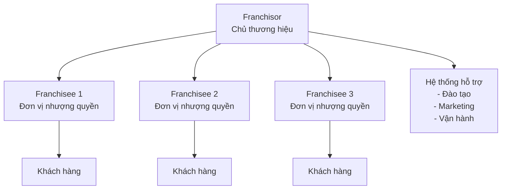

# Nhượng quyền là gì?

Nhượng quyền (Franchising) là một mô hình kinh doanh trong đó chủ sở hữu thương hiệu (franchisor) cấp phép cho bên thứ ba (franchisee) sử dụng thương hiệu, hệ thống kinh doanh và hỗ trợ vận hành để mở và quản lý một đơn vị kinh doanh.

## 🎯 Định nghĩa chính thức

Theo **Luật Thương mại Việt Nam 2005**, nhượng quyền thương mại được định nghĩa là:

> "Hoạt động thương mại, theo đó bên nhượng quyền cho phép và yêu cầu bên nhận quyền tự mình tiến hành việc mua bán hàng hóa, cung ứng dịch vụ theo cách thức tổ chức kinh doanh do bên nhượng quyền quy định và được gắn với nhãn hiệu hàng hóa, tên thương mại, bí quyết kinh doanh, khẩu hiệu kinh doanh, biểu tượng kinh doanh, quảng cáo của bên nhượng quyền."

## 🔑 Các đặc điểm chính

### 1. **Quyền sử dụng thương hiệu**
- Franchisee được phép sử dụng tên thương hiệu, logo, slogan
- Phải tuân thủ các quy định về bảo vệ thương hiệu
- Không được thay đổi hoặc sửa đổi thương hiệu

### 2. **Hệ thống kinh doanh chuẩn hóa**
- Quy trình vận hành được định sẵn
- Tiêu chuẩn chất lượng sản phẩm/dịch vụ
- Hệ thống quản lý và báo cáo thống nhất

### 3. **Đào tạo và hỗ trợ**
- Chương trình đào tạo ban đầu cho franchisee
- Hỗ trợ liên tục trong quá trình vận hành
- Cập nhật kiến thức và kỹ năng

### 4. **Phí và khoản thanh toán**
- **Phí nhượng quyền ban đầu** (Franchise Fee)
- **Phí bản quyền hàng tháng** (Royalty Fee)
- **Phí quảng cáo** (Advertising Fee)
- **Phí đào tạo và hỗ trợ**

### 5. **Thời hạn hợp đồng**
- Thường từ 5-20 năm
- Có thể gia hạn theo thỏa thuận
- Điều kiện chấm dứt hợp đồng

## 🏗️ Cấu trúc mối quan hệ

## 📊 So sánh với các mô hình khác

| Đặc điểm | Nhượng quyền | Đại lý | Chi nhánh | Độc lập |
|----------|--------------|--------|-----------|---------|
| **Quyền sở hữu** | Không | Không | Có | Có |
| **Đầu tư ban đầu** | Trung bình | Thấp | Cao | Cao |
| **Rủi ro** | Trung bình | Thấp | Cao | Cao |
| **Hỗ trợ** | Cao | Trung bình | Cao | Không |
| **Tự do vận hành** | Hạn chế | Hạn chế | Cao | Cao |

## 🌟 Lợi ích của mô hình nhượng quyền

### Đối với Franchisor (Chủ thương hiệu)
- **Mở rộng nhanh chóng** với chi phí thấp
- **Giảm rủi ro** tài chính
- **Tăng doanh thu** từ phí bản quyền
- **Phát triển thương hiệu** trên toàn quốc

### Đối với Franchisee (Người nhận quyền)
- **Sử dụng thương hiệu** đã có uy tín
- **Hệ thống kinh doanh** đã được kiểm chứng
- **Đào tạo và hỗ trợ** chuyên nghiệp
- **Giảm rủi ro** khởi nghiệp

## ⚠️ Rủi ro cần lưu ý

### Rủi ro cho Franchisee
- **Phụ thuộc vào franchisor** về quyết định kinh doanh
- **Chi phí cao** cho phí và khoản thanh toán
- **Hạn chế tự do** trong vận hành
- **Rủi ro pháp lý** nếu vi phạm hợp đồng

### Rủi ro cho Franchisor
- **Mất kiểm soát** chất lượng
- **Rủi ro danh tiếng** từ franchisee kém
- **Chi phí hỗ trợ** cao
- **Xung đột pháp lý** với franchisee

## 🎯 Kết luận

Nhượng quyền là một mô hình kinh doanh phức tạp nhưng có tiềm năng lớn cho cả hai bên. Việc hiểu rõ bản chất và đặc điểm của mô hình này là bước đầu tiên quan trọng để đưa ra quyết định đầu tư đúng đắn.

## 📚 Tài liệu liên quan

- [Lợi ích và rủi ro của nhượng quyền](/getting-started/benefits-and-risks/)
- [Các loại hình nhượng quyền](/getting-started/types-of-franchising/)
- [Quy trình đăng ký nhượng quyền](/getting-started/registration-process/)

---

**Bước tiếp theo**: Tìm hiểu về [lợi ích và rủi ro](/getting-started/benefits-and-risks/) của mô hình nhượng quyền để có cái nhìn toàn diện hơn.
